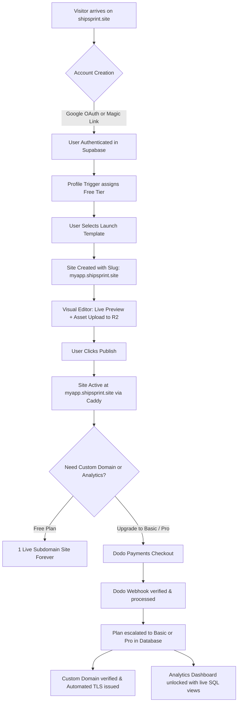
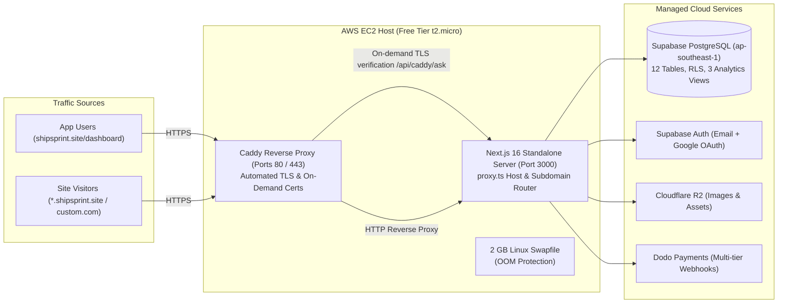

# ShipSprint — Production Implementation & Architecture Master Plan

**Document Version:** 2.0.0  
**Status:** Database Live & Verified · Build & Test Suite Green · Production Ready  
**Date:** September 30, 2026  

---

## 1. Quick Answers & Operational Guides

### 1.1 Generating `CRON_SECRET`
The `CRON_SECRET` protects internal maintenance tasks (`/api/cron/maintenance`) from unauthorized public requests.
* **Pre-generated 32-byte Cryptographic Secret (Ready to Copy):**
  ```env
  CRON_SECRET=c993e9ddc6aab23af6c903bf533e51e94e566e14be526f74279d54a7d193e25d
  ```
* **Command to generate a new one anytime:**
  - In Node.js: `node -e "console.log(require('crypto').randomBytes(32).toString('hex'))"`
  - In PowerShell: `[System.BitConverter]::ToString((New-Object System.Security.Cryptography.RNGCryptoServiceProvider).GetBytes((New-Object byte[] 32))).Replace("-","").ToLower()`

---

### 1.2 Step-by-Step Guide: Cloudflare R2 Setup
Cloudflare R2 provides zero-egress cost S3-compatible object storage for user image uploads.

1. **Log in to Cloudflare:** Go to [dash.cloudflare.com](https://dash.cloudflare.com).
2. **Open R2:** Click on **R2** in the left-hand navigation menu.
3. **Create Bucket:**
   - Click **Create bucket**.
   - Name the bucket: `shipsprint-assets` (or a name of your choice).
   - Region: Select **Automatic** (or closest to your users, e.g. APAC).
   - Click **Create Bucket**. This name is your `R2_BUCKET_NAME`.
4. **Locate Account ID:**
   - On the R2 Overview page, locate **Account ID** in the right-hand sidebar.
   - Copy this string -> this is your `R2_ACCOUNT_ID`.
5. **Create S3 API Tokens:**
   - On the R2 Overview page, click **Manage R2 API Tokens** (top-right corner).
   - Click **Create API token**.
   - Token name: `shipsprint-production`.
   - Permissions: Select **Object Read & Write**.
   - Specify bucket: You can choose "All buckets" or limit to `shipsprint-assets`.
   - TTL: Leave blank / Forever.
   - Click **Create API Token**.
   - Cloudflare will display:
     - **Access Key ID** -> copy to `R2_ACCESS_KEY_ID`.
     - **Secret Access Key** -> copy to `R2_SECRET_ACCESS_KEY` *(Save immediately; it is only shown once)*.
6. **Public Asset Delivery Domain:**
   - Under bucket settings -> **Public Access** -> **Custom Domains**:
     - Connect a subdomain (e.g. `assets.shipsprint.site`) or enable the free `r2.dev` testing domain.
     - Set this as `R2_PUBLIC_DOMAIN` in `.env.local`.

---

### 1.3 Syncing Dodo Product IDs into the Live Database
Since you created your 4 products in Dodo Payments and added their product IDs to `.env.local`, you must also link them into the database so the checkout session creator can resolve them:
```sql
update public.products set dodo_product_id = 'pdt_YOUR_BASIC_MONTHLY_ID' where id = 'basic_monthly';
update public.products set dodo_product_id = 'pdt_YOUR_BASIC_YEARLY_ID'  where id = 'basic_yearly';
update public.products set dodo_product_id = 'pdt_YOUR_PRO_MONTHLY_ID'   where id = 'pro_monthly';
update public.products set dodo_product_id = 'pdt_YOUR_PRO_YEARLY_ID'    where id = 'pro_yearly';
```
*(You can run this query once in the Supabase SQL editor or provide the IDs and we can execute it via the verified pooler script).*

---

### 1.4 Step-by-Step Guide: Supabase Auth & Google OAuth

#### Part A: Supabase Redirect URLs
1. Open your [Supabase Dashboard](https://supabase.com/dashboard) and select project `mhkrbkyeixtacpbabbeh`.
2. In the left navigation, click **Authentication** -> **URL Configuration**.
3. Under **Site URL**, set:
   ```text
   https://shipsprint.site
   ```
4. Under **Redirect URLs**, click **Add URL** and add each of the following:
   ```text
   https://shipsprint.site/auth/callback
   https://www.shipsprint.site/auth/callback
   http://localhost:3000/auth/callback
   http://*.localhost:3000/auth/callback
   ```
5. Click **Save**.

#### Part B: Enabling Google OAuth
1. Go to the [Google Cloud Console](https://console.cloud.google.com/).
2. Create a new project (e.g., `ShipSprint`).
3. Navigate to **APIs & Services** -> **OAuth consent screen**:
   - User Type: Select **External**, then click **Create**.
   - App Name: `ShipSprint`.
   - User Support Email: Your personal/admin email.
   - Developer Contact Email: Your email.
   - Scopes: Add `.../auth/userinfo.email`, `.../auth/userinfo.profile`, `openid`.
   - Save and continue.
4. Navigate to **APIs & Services** -> **Credentials**:
   - Click **Create Credentials** -> **OAuth client ID**.
   - Application Type: **Web application**.
   - Name: `ShipSprint Web Client`.
   - **Authorized JavaScript origins:**
     - `https://mhkrbkyeixtacpbabbeh.supabase.co`
     - `https://shipsprint.site`
     - `http://localhost:3000`
   - **Authorized redirect URIs (CRITICAL):**
     - Copy your Supabase callback URL: `https://mhkrbkyeixtacpbabbeh.supabase.co/auth/v1/callback`
   - Click **Create**.
   - Copy the generated **Client ID** and **Client Secret**.
5. Back in **Supabase Dashboard**:
   - Go to **Authentication** -> **Providers** -> **Google**.
   - Toggle **Google Enabled** to `ON`.
   - Paste **Client ID** and **Client Secret**.
   - Click **Save**.

---

### 1.5 Hostinger DNS + AWS EC2 Architecture & Free Tier Sizing

#### What AWS EC2 Free Tier Server Should You Use?
* **Recommended Instance:** **`t2.micro`** (or **`t3.micro`** in newer regions: 2 vCPUs, 1 GB RAM, free for 750 hours/month on AWS Free Tier).
* **Can a 1 GB RAM EC2 instance host user websites reliably?**
  **YES**, because of how ShipSprint is engineered:
  1. **Next.js Standalone Build:** Ships only minimal pruned Node modules (~120–160 MB runtime RAM).
  2. **Caddy Edge Proxy:** Written in Go; serves HTTP/2 and HTTP/3 TLS termination using only ~30–45 MB RAM.
  3. **No Local Database:** PostgreSQL is managed on Supabase Cloud (`ap-southeast-1` Singapore pooler), requiring 0 MB of your EC2 RAM.
  4. **No Local Media Storage:** Cloudflare R2 serves all images and uploads directly, requiring 0 disk I/O on EC2.
* **Essential Safeguards for 1 GB EC2:**
  - Configure a **2 GB Swap file** on Ubuntu (`fallocate -l 2G /swapfile && chmod 600 /swapfile && mkswap /swapfile && swapon /swapfile`). This guarantees no Out-Of-Memory crashes during Next.js background revalidations.
  - Allocate an **Elastic IP** in AWS EC2 (free when attached to a running instance) so your server's public IP address never changes.

#### Connecting Hostinger Domain (`shipsprint.site`) to AWS EC2
In **Hostinger hPanel** -> **Domains** -> `shipsprint.site` -> **DNS / Nameservers**:
Add the following 3 `A` Records pointing to your **AWS EC2 Elastic IP**:

| Type | Name | Content / Points to | TTL | Purpose |
| :--- | :--- | :--- | :--- | :--- |
| **`A`** | `@` | `<YOUR_EC2_ELASTIC_IP>` | 300 | Main app homepage (`shipsprint.site`) |
| **`A`** | `*` | `<YOUR_EC2_ELASTIC_IP>` | 300 | Wildcard subdomains (`*.shipsprint.site`) for customer sites |
| **`A`** | `cname` | `<YOUR_EC2_ELASTIC_IP>` | 300 | Verification CNAME target for custom domains |

> [!CAUTION]
> 1. Do **not** add a `www` record in Hostinger — Caddy handles canonical redirection automatically. Adding a duplicate record causes ACME TLS certificate conflicts.
> 2. Do **not** delete existing MX or TXT email records if you use Hostinger email.

---

## 2. Competitive Teardown: QuickLaunch (`quicklaunch.tech`) vs ShipSprint

Our live audit of `quicklaunch.tech` revealed key architectural constraints in their product that inform ShipSprint's competitive advantage:

```
┌─────────────────────────────────┬──────────────────────────────────┐
│   QuickLaunch (quicklaunch.tech)│         ShipSprint (Ours)        │
├─────────────────────────────────┼──────────────────────────────────┤
│ Client-side SPA (React bundle)  │ Server-Rendered / SSR + Islands  │
│ Simply.com WAF / Slow TTFB      │ Caddy Edge TLS + Cloudflare R2   │
│ Generic AI prompt generation    │ Dedicated Mobile App/SaaS Launch │
│ Shallow block customization     │ Granular, zero-drift field edit  │
│ Trial-based / Paid friction     │ Generous free-forever 1-site tier│
│ No native analytics telemetry   │ Cookieless SQL analytics built-in│
│ No App Store / Play Store badge │ Native App Store & Play Badges   │
└─────────────────────────────────┴──────────────────────────────────┘
```

### Strategic Differentiators for ShipSprint:
1. **Zero-Drift Guarantee:** QuickLaunch renders in a client-side SPA. ShipSprint uses a single unified renderer (`components/renderer/site-renderer.tsx`) that powers the visual editor, template picker, and live published site with zero visual drift.
2. **Superior Mobile App Launcher Surfaces:** QuickLaunch builds generic business homepages. ShipSprint specifically serves app developers with native iOS/Android store buttons, screenshot carousels, pricing toggles, and feature grids.
3. **Built-in First-Party Analytics:** While QuickLaunch offers no telemetry, ShipSprint provides privacy-first, cookieless traffic metrics (pageviews, CTA clicks, referrer origins, mobile/desktop breakdown) powered by our live PostgreSQL security-invoker views.
4. **Permanent Free Tier:** ShipSprint gives indie developers a permanent launch pad on `slug.shipsprint.site` with automated TLS, creating an unbeatable top-of-funnel acquisition engine.

---

## 3. End-to-End System Architectures

### 3.1 Complete User Lifecycle Architecture


---

### 3.2 Application & Multi-Tenant Edge Architecture


---

## 4. Master 7-Phase Implementation Roadmap

### Phase 1: Environment & Cloud Integration (Blockers)
* [x] Schema applied to live Supabase DB (`ap-southeast-1`) with 12 RLS tables.
* [ ] Add `CRON_SECRET` to `.env.local`.
* [ ] Configure Cloudflare R2 bucket tokens (`R2_ACCOUNT_ID`, `R2_ACCESS_KEY_ID`, `R2_SECRET_ACCESS_KEY`, `R2_BUCKET_NAME`).
* [ ] Execute SQL to link live Dodo Product IDs into `public.products`.
* [ ] Configure Supabase redirect URLs & Google OAuth provider in Supabase Dashboard.
* [ ] Point Hostinger DNS `A` records (`@`, `*`, `cname`) to AWS EC2 Elastic IP.

### Phase 2: Database Type Safety & Strict Cast Removal
* Run `supabase gen types typescript` to generate schema definitions.
* Replace hand-written types in `types/database.ts` with compiler-verified definitions.
* Eliminate manual `as Plan`, `as Site`, and `as Profile` casts across dashboard and editor components.

### Phase 3: Analytics View Transition (Performance Optimization)
* Refactor `app/(dashboard)/dashboard/analytics/page.tsx` to query:
  - `public.site_analytics_summary`
  - `public.site_analytics_sources`
  - `public.site_analytics_cta`
* Remove browser-side service-role client instantiation; rely on authenticated `security_invoker` policies.
* Fix bar chart zero-height rendering bug.

### Phase 4: Public Site Rendering Performance & SEO
* Deduplicate `getSiteBySlugOrDomain` across `generateMetadata` and `Page` using React `cache()`.
* Convert `components/renderer/site-renderer.tsx` to a Server Component with lightweight client interactive islands.
* Replace unoptimized `` tags with `next/image` leveraging Cloudflare R2 remote patterns.
* Dynamically generate per-site `/sitemap.xml` and `/robots.txt` for tenant subdomains and custom domains.

### Phase 5: Template Engine & Gallery (Core Differentiator)
* Seed 4–6 high-converting starter templates into `public.templates` (SaaS, Mobile App, AI Tool, Waitlist).
* Build public `/templates` gallery preview.
* Integrate template selection inside `create-site-dialog.tsx`.
* Pass `template_id` to `POST /api/sites` to instantiate site content from chosen template.

### Phase 6: Editor UX, Data Loss Prevention & Accessibility
* Implement `beforeunload` listener and navigation guard when `hasUnsavedChanges` is true.
* Implement debounced background auto-save to draft state.
* Reset hidden file input values after upload to allow re-uploading the same file.
* Build mobile hamburger drawer navigation in `components/dashboard/dashboard-nav.tsx`.
* Add accessibility attributes (`htmlFor`, `id`, `aria-modal`, modal focus traps).

### Phase 7: Observability, Legal & AWS EC2 Production Launch
* Integrate `@sentry/nextjs` with `instrumentation.ts` for error tracking.
* Add `/terms`, `/privacy`, and `/imprint` static pages with signup agreement checkbox.
* Deploy Docker Compose stack on AWS EC2 (`t2.micro` or `t3.micro` with Caddy + Next.js standalone).
* Run end-to-end smoke test: Signup -> Template Selection -> Site Publish -> Custom Domain -> Payment Upgrade.
